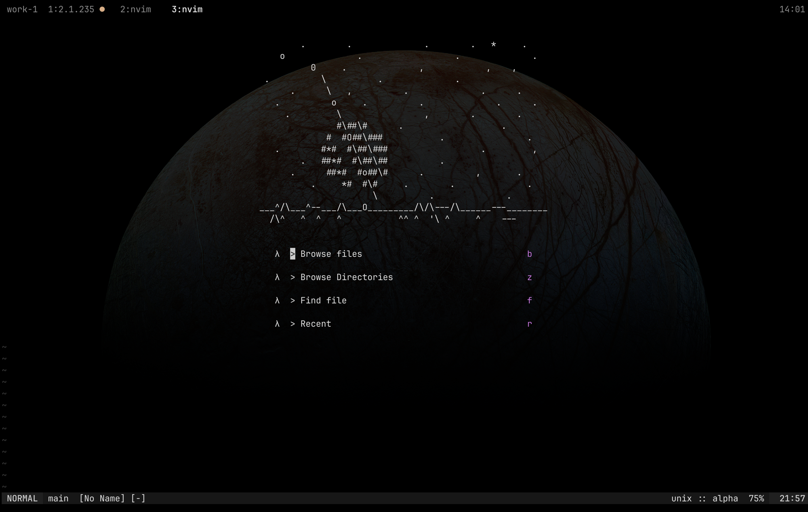
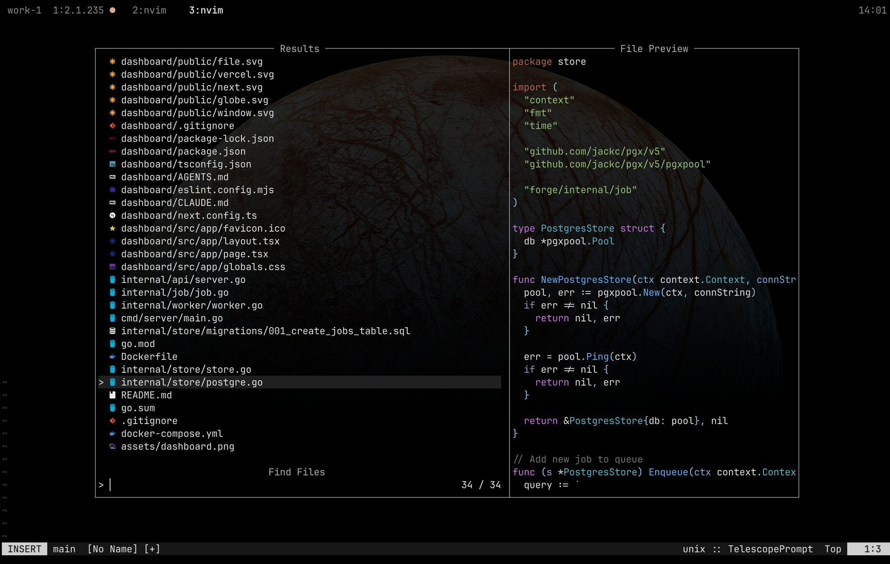
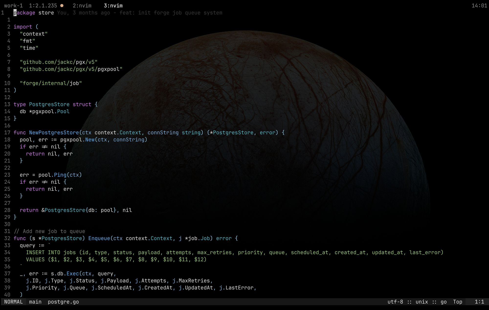
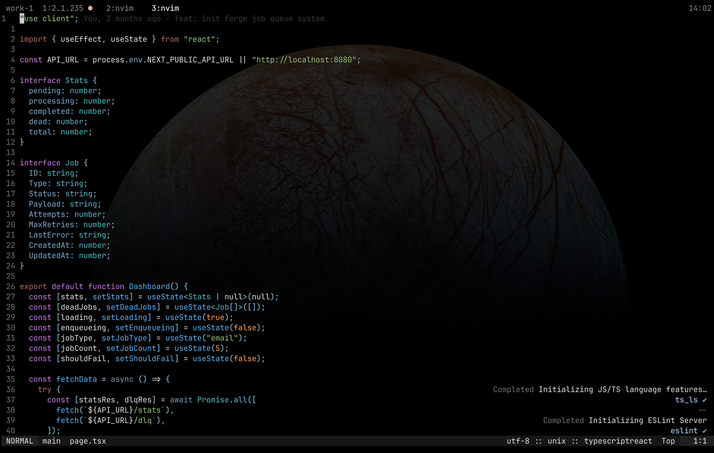

# dots

My personal macOS dotfiles: tmux + nvim + starship + kitty, built around
an agent-driven development workflow with Claude Code (git worktrees per
task, one-key session creation/cleanup) and a competitive-programming
setup for Codeforces.

## Screenshots






## What's here

- `tmux/` — tmux config, grayscale status bar with a live Claude Code
  activity indicator, agent-workflow keybinds
- `nvim/` — Neovim config (lazy.nvim), `no-clown-fiesta` colorscheme with
  custom syntax/diagnostic color overrides, `competitest.nvim` for
  competitive programming
- `starship/` — prompt config matching the tmux grayscale theme
- `kitty/` — terminal config + background wallpaper
- `scripts/` — `agent-new.sh` / `agent-close.sh` / `agent-link.sh` /
  `tmux-equalize.sh`, the agent-workspace workflow (see
  `cheatsheets/tmux.md` for keybinds)
- `cp/templates/` — C++/Go competitive-programming templates
- `zshrc` — shell config
- `archive/` — configs for tools no longer in active use on this machine
  (alacritty, ghostty, wezterm, hyprland/waybar/wofi, aerospace), kept for
  reference only, not installed by `install.sh`

## Prerequisites

- macOS
- [Homebrew](https://brew.sh)
- A terminal with Nerd Font support (this setup uses
  [kitty](https://sw.kovidgoyal.net/kitty/))

## Install

```bash
git clone https://github.com/adityanagar10/dots ~/dots
cd ~/dots
./install.sh
```

This symlinks each config into place (backing up anything already there),
installs the required Homebrew packages and fonts, and clones the tmux
plugin manager.

## After installing

1. Copy the secrets template and fill in real values:
   ```bash
   cp secrets.zsh.example ~/.config/secrets.zsh
   chmod 600 ~/.config/secrets.zsh
   ```
2. Authenticate GitHub CLI: `gh auth login`
3. Register the Grafana MCP servers for Claude Code (see `install.sh`'s
   output for the exact commands)
4. Open tmux, press `prefix + I` to install tmux plugins via tpm

## Agent workflow

`prefix + A` creates a new git worktree + tmux session for a branch and
launches Claude Code in it. `prefix + X` closes it out (kills the
session, removes the worktree, deletes the branch). `prefix + L` links
another repo's code into the current worktree for cross-repo context.
`prefix + ?` opens the full keybinding cheat-sheet.
